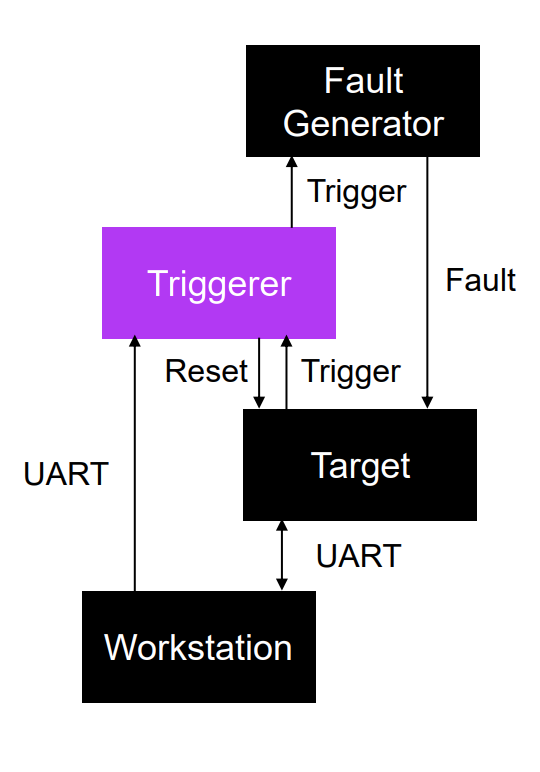
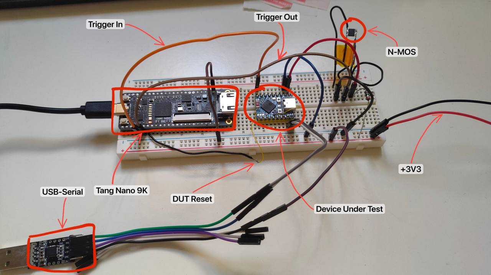

# FPGATriggerer

## Description

The goal of this project was to build a cheap triggering system for fault injection and side channel
attacks, based on FPGA to achieve high speeds.
To do this we used
a [Tang Nano 9K](https://wiki.sipeed.com/hardware/en/tang/Tang-Nano-9K/Nano-9K.html) board by Sipeed
and the open source
tools [Yosys](https://github.com/YosysHQ/yosys), [nextpnr-apicula](https://github.com/YosysHQ/apicula)
and [openFPGALoader](https://github.com/trabucayre/openFPGALoader).

The project is written in Verilog and is built using a block architecture. Each module does some
processing on the input and passes it to the next block up to the output stage.

## Features

Currently, the supported features are:

- **Digital Edge Detector**: It is part of the data acquisition stage, based on the configuration,
  detects the rising or the falling edge of the input signal.
- **Delay Module**: It is part of the processing stage, applies an operation to the input signal, in
  this case it waits a specified amount of time in clock cycles. With a 6ns precision(166MHz) due to
  the current design.
- **Pulse Extender**: It is part of the output stage, takes a trigger in input with a duration of 1
  clock cycle and extends it to a configured amount of clock cycles.
- **Target Resetter**: Used to reset the target when it hangs. It just controls a GPIO via the
  Python API.

## Python API

To configure the device you can use the serial port exposed by the board through the Python lib
that you can find in the python folder or [here](python/FPGATriggererPythonAPI.py).
 
In the [report](report/FPGATriggererITA.pdf) you can find some examples.

## Tools used

As described before we wanted to use only FOSS tools, however the bitstream generation was not
quite ready for the FPGA we used, I had some errors with the IDCODE
(not so difficult to fix if you have time to investigate) so I couldn't use Yosys and nextpnr.
 
I used openFPGALoader to load the bitstream on the device and the Educational edition of the Gowin
IDE to manage the project, synthesize it and debug it via the Gowin Analyzer.

## TODO

As this project was just a prototype there are many things that would be useful when using it. Some
of them have already been documented in the italian report and they are:

- **Analog SAD Module**: we need an ADC to read analog signals.
- **Sequencer**: to define the modules you want to use and the order. Needed for example if you want
  to trigger on an analog pattern after receiving a digital input trigger.

Also:

- **Utility library**: to give you the possibility to plot the attack results in a graphical manner.

## Notice

As I finished the internship that sponsored this project and I don't have the necessary
tools(mainly a fast oscilloscope) the project is currently HALTED.

## Setup

The general block setup is like this:\

## Voltage Glitching Setup

To test the project on a real target(ESP32-S3) I assembled the following circuit. We used the
crowbar technique :\

### Results

With the previous setup I managed to get this result but, for a question of time, I didn't manage to
glitch the target in a useful manner.
